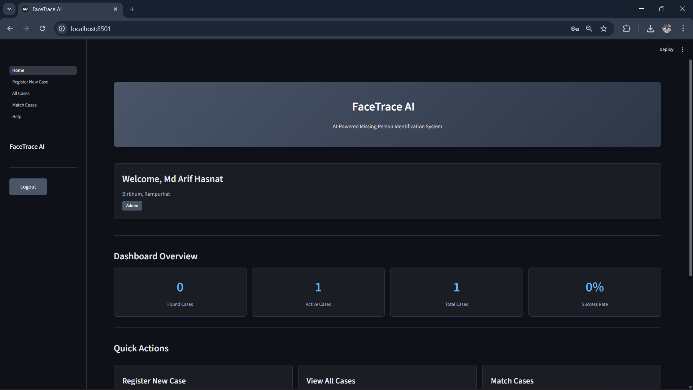

# 🔍 FaceTrace AI

**Author:** Md Arif Hasnat


---

## 📸 Preview

<p align="center">
  
</p>

*FaceTrace AI Dashboard - Clean, minimal interface with blue-gray theme*

---

## 📋 Overview

**FaceTrace AI** is an AI-powered application to help locate missing persons using facial recognition technology. This project leverages **MediaPipe Face Mesh** for accurate facial landmark detection and matching, making it easier for law enforcement, NGOs, and the public to assist in finding missing individuals.

---

## ✨ Key Features

| Feature | Description |
|---------|-------------|
| 🔍 **Face Mesh Detection** | Extracts 468 facial landmarks using MediaPipe for accurate identification |
| 📝 **Case Registration** | Register missing persons with photos and detailed information |
| 🎯 **AI Matching** | Automatically match submitted photos against registered cases |
| 📱 **Mobile Support** | Dedicated mobile app for public submissions and sighting reports |
| 💾 **Lightweight Database** | SQLite-based storage for easy deployment and portability |
| 📊 **Dashboard** | View and manage all registered cases with status tracking |

---

## 🛠️ Technology Stack

- **Frontend:** Streamlit
- **AI/ML:** MediaPipe Face Mesh, OpenCV
- **Database:** SQLite
- **Authentication:** Streamlit Authenticator
- **Language:** Python 3.10+

---

## 🚀 Getting Started

### Prerequisites

- Python 3.10 or higher
- pip (Python package manager)

### Installation

1. **Clone the repository:**

   ```bash
   git clone https://github.com/yourusername/FaceTrace-AI.git
   cd FaceTrace-AI
   ```

2. **Install dependencies:**

   ```bash
   pip install -r requirements.txt
   ```

3. **Run the application:**

   ```bash
   streamlit run Home.py
   ```

4. **Run mobile app (optional):**

   ```bash
   streamlit run mobile_app.py
   ```

### Default Login Credentials

| Username | Password |
|----------|----------|
| `arif` | `abc` |

---

## 📁 Project Structure

```
FaceTrace-AI/
├── Home.py                 # Main application entry point
├── mobile_app.py           # Mobile submission app
├── login_config.yml        # Authentication configuration
├── requirements.txt        # Python dependencies
├── pages/
│   ├── 1_Register New Case.py
│   ├── 2_All Cases.py
│   ├── 3_Match Cases.py
│   ├── 4_Help.py
│   └── helper/
│       ├── data_models.py
│       ├── db_queries.py
│       ├── match_algo.py
│       ├── utils.py
│       └── streamlit_helpers.py
└── resources/              # Image storage
```

---

## 💡 How It Works

1. **Registration:** Upload a photo of the missing person along with their details
2. **Face Mesh Extraction:** The system automatically extracts 468 facial landmarks using MediaPipe
3. **Database Storage:** Case details and face mesh data are stored in SQLite
4. **Matching:** When a new sighting is reported, the system compares face mesh data to find potential matches
5. **Notification:** Matched cases are flagged for review by authorities

---

## 📖 Use Cases

- 👮 **Law Enforcement:** Quickly scan and match CCTV footage against registered cases
- 🏛️ **Government Agencies:** Centralized database for missing person records
- 🤝 **NGOs:** Coordinate search efforts with facial recognition support
- 👥 **Public:** Submit sighting reports through the mobile app

---

## 🙏 Acknowledgments

- [MediaPipe](https://mediapipe.dev/) - For the excellent face mesh solution
- [Streamlit](https://streamlit.io/) - For the amazing web framework
- Original project inspiration from the open-source community

---

## 📄 License

This project is open source and available under the MIT License.

---

**Developed with ❤️ by Md Arif Hasnat**
